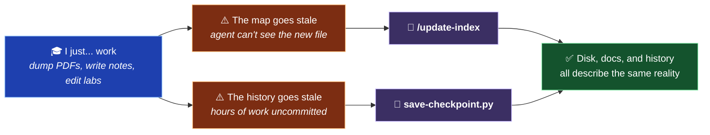
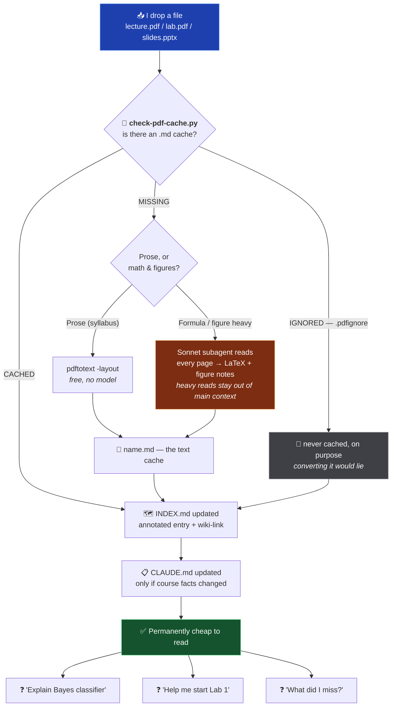

# KMUTT Year3 semester1 - Computer Engineering

**A context engineering platform for surviving one semester of Computer Engineering.**

> **TL;DR** — I drop a lecture PDF into a folder. The repo turns it into machine-readable Markdown, writes a summary of it into a map file, and links it into a graph. From then on, any AI agent I open here already knows what the course is, who teaches it, what's been covered, what's due, and how the lecturer wants it. I never explain my semester to a chatbot twice.

---

## The Problem

Every conversation with an AI assistant starts at zero.

You paste a slide deck. You explain that you're in Machine Learning. You explain that the deadline is one week and the lecturer forbids posted solutions. You get an answer. You close the tab. **All of that context evaporates.** Tomorrow you do it again, worse, because you forgot half the details.

Meanwhile the raw material is hostile to machines. A lecture deck is 83 slides of images — reading it burns enormous context, and every equation comes out as `������`.

So you end up paying the same expensive setup cost on every single question, forever.

## The Thesis

> ### Hard compute once. Cheap forever.

Pay the expensive cost **exactly once**, at ingest time, and write the result down in a durable, plain-text form. Every question after that is cheap, because the hard part is already on disk.

| Phase                                                                                        | Cost                                                     | How often               |
| -------------------------------------------------------------------------------------------- | -------------------------------------------------------- | ----------------------- |
| **Ingest** — read the PDF, transcribe the math, describe the figures, summarize, index, link | Expensive (a subagent reads every page)                  | **Once per file, ever** |
| **Query** — "explain LDA", "help me plan Lab 1", "what's on the midterm?"                    | Nearly free (reads a 40-line map, then one cached `.md`) | Unlimited               |

The user's entire job is **step one of a two-step pipeline**: put the file in the folder.

---

## The Two Main Commands

**Everything else in this repo is scaffolding. These two commands are the product.**

They attack the same enemy — **drift** — on two different axes. I am a person who dumps files into folders and forgets, who works for three hours straight and never commits. Neither command asks me to stop being that person. They just make catching up cost one keystroke instead of a chore I'll skip.

|     | Command                         | Keeps in sync                              | The question it kills               |
| --- | ------------------------------- | ------------------------------------------ | ----------------------------------- |
| 🧠  | **`/update-index [folder]`**    | What the **agent** knows ⟷ what's on disk  | _"Does the AI see what I see?"_     |
| 💾  | **`python save-checkpoint.py`** | What **git** records ⟷ what I actually did | _"Is today's work actually saved?"_ |



### 🧠 `/update-index [folder]` — so the agent sees what I see

The ingest pipeline, and the reason this repo is cheap to talk to. It lists a class folder, finds every file the docs don't know about yet, converts each un-cached PDF to Markdown (cheapest method first, subagent only when the math demands it), rewrites `INDEX.md` and `CLAUDE.md` to match what's actually on disk, verifies every wiki-link still resolves, and leaves `temp/` untouched.

It is **idempotent and self-healing**: run it any time, on anything. If nothing drifted, it costs nothing. If ten files drifted, one command fixes all ten. You never have to remember _whether_ you need it — that's the point, because I won't.

### 💾 `save-checkpoint.py` — so the work is never the thing I lose

A semester vault doesn't need a branching model, a review process, or a commit message you agonize over. It needs **checkpoints**. So this is one command with no required arguments that stages the whole vault, commits it as `<dd>/<mm>/<BE year>-<n>` — Thai Buddhist Era, `n` auto-incrementing per day — and pushes.

```bash
python save-checkpoint.py                  # stage everything → commit
python save-checkpoint.py -n "did lab 1"   # ...with a note in the commit body
python save-checkpoint.py --push           # commit and push
python save-checkpoint.py --dry-run        # show the plan, touch nothing
```

The number is derived by reading `git log`, not stored in a counter file, so there is nothing to desync across machines. It stages from the **repo root**, not the current directory, so running it from inside a class folder still saves the whole vault. And a failed push is reported as a warning, not a crash — the commit already exists locally, and telling you otherwise would make you redo work that was never lost.

### Why they're one idea wearing two hats

Both obey the same three-part contract, which is really the design philosophy of the whole repo:

1. **Auto-find, never interrogate.** Neither command asks me what changed. They both go look. A tool that requires me to accurately describe my own mess is a tool that inherits my unreliability.
2. **Hard compute once.** `/update-index` pays for the PDF read exactly once and caches it forever. `save-checkpoint.py` computes the commit number from history that already exists. Nothing expensive happens twice.
3. **Friction is the only real failure mode.** A correct system I don't run is worth less than a decent system I run constantly. Both commands are one line, zero decisions, no ceremony — because the version that demanded thought is the version I'd abandon in nine days.

Together they let me use this like a **real vault** — dump things in, work messily, stay human — while the agent still sees the exact same picture I do, with nothing wasted on either side.

---

## How It Works



The whole pipeline is one command: [`/update-index`](.claude/commands/update-index.md).

---

## Quick Start

```bash
git clone https://github.com/jakkarin-promsee/kmutt-y3-s1.git
cd kmutt-y3-s1
claude
```

**One setup step, once per machine.** In Obsidian: \*Settings → Files and links → **Detect all file extensions\*** — on. Without it Obsidian ignores `.pptx` and `.py` entirely, and any `[[link]]` to one renders perfectly while resolving to nothing. The setting lives in `.obsidian/`, which is gitignored, so every fresh clone starts with it off.

### Daily use (this is the entire workflow)

**1. Drop the file where it belongs.**

```
CPE342-machine-learning/lecture/Lecture+2+-+Regression.pdf
```

**2. Tell the agent to absorb it.**

```bash
/update-index CPE342-machine-learning
```

**3. There is no step 3.** Ask it anything.

```
> I have Lab 1 due Friday. Walk me through what it's actually asking for.
> Quiz me on Lecture 1 — I have a midterm.
> Brainstorm three approaches for the assignment, then tell me which one is dumb.
```

The agent already read the course policies, the grading breakdown, the instructor's quirks, and every lecture you've ever added. You don't brief it. That's the point.

**Then, when you stand up from the desk:**

```bash
python save-checkpoint.py
```

One line, no message to write, no branch to pick. Staged, committed as `04/08/2569-3`, pushed. The day is saved whether or not you were disciplined about it.

---

## Repository Layout

```
kmutt-y3-s1/
├── CLAUDE.md                    # 🧠 THE CONSTITUTION — vault-wide rules, read first, always
├── README.md                    # 📖 you are here
├── PROBLEM.md                   # 🐛 my running pain-point log for the system itself
├── save-checkpoint.py           # ⭐ CORE — one-command checkpoint: add + commit + push
├── check-pdf-cache.py           # 🔎 which PDFs still need a Markdown cache (honours .pdfignore)
│
├── format-template/             # 🧬 the seed — copy this to create a new class
│   ├── CLAUDE.md                #    blank per-class instruction file
│   └── INDEX.md                 #    blank map file
│
├── prompts/                     # 🗂️  reusable prompt drafts of mine — not part of the system
│
├── CPE333-operating-systems/    # 🟢 one folder per class, identical shape (see below)
├── CPE334-software-engineering/ # 🟢
├── CPE342-machine-learning/     # 🟢
├── PRE380-engineering-economy/  # 🟢
│
├── .claude/                     # ⚙️  agent config
│   ├── commands/update-index.md # ⭐ CORE — the ingest command
│   ├── skills/vault-writing/    # 📐 Law II — link syntax, formatting, prose wrap
│   ├── skills/pdf-cache/        # 📄 Law I — PDF → Markdown, the cheap way
│   ├── settings.json            #    shared permissions (committed)
│   └── settings.local.json      #    personal permissions (gitignored)
├── .gitignore                   # 🙈 temp/, secrets, node_modules — a checkpoint stages everything
└── .obsidian/                   # 🔗 vault config (gitignored — machine-local)
```

### Every class folder is the same shape

Identical layout across all classes is not aesthetics — it's what lets an agent navigate a course it has never seen before without being told anything.

```
<CODE>-<kebab-case-name>/
├── CLAUDE.md      # 📋 course facts + class-specific rules (instructor, grading, policies)
├── INDEX.md       # 🗺️ annotated map of every file — the agent's entry point
├── .pdfignore     # 🚫 optional — PDFs in this class that must never be cached
├── lecture/       # 📚 from the lecturer: slides, PDFs, readings (+ their .md caches)
├── assignment/    # ✏️  briefs, my working files, submissions
├── note/          # 🖊️  my own writing worth keeping
└── temp/          # 🗑️  scratch. volatile. never documented. here be dragons.
```

**Where does a file go?** From the lecturer → `lecture/`. About one assignment → `assignment/`. My own keeper writing → `note/`. Half-baked garbage → `temp/`.

---

## The Three-Layer Context Protocol

The core design. An agent entering this repo reads **top-down, narrowing**, and is oriented before it opens a single real file:


| Layer | File                          | Answers                                        | Analogy              |
| ----- | ----------------------------- | ---------------------------------------------- | -------------------- |
| 1     | Root [`CLAUDE.md`](CLAUDE.md) | _How does this system work?_                   | The OS               |
| 2     | `<class>/CLAUDE.md`           | _What is this course, and how do I help here?_ | Per-app config       |
| 3     | `<class>/INDEX.md`            | _What's in this folder, and what's it about?_  | The filesystem index |
| 4     | The file itself               | _The actual content_                           | The data             |

**Why `INDEX.md` matters more than it looks.** It isn't a file listing — it's a _summary layer_. Each entry says what the file covers, in enough detail that the agent can answer many questions **without opening the file at all**, and knows exactly which file to open when it can't. It's a hand-maintained cache of "what do I know about this course." That's the whole trick.

> **Real example** — the Lecture 1 entry in [`CPE342-machine-learning/INDEX.md`](CPE342-machine-learning/INDEX.md) breaks 83 slides into three sections with every topic named: statistical learning, Bayes' classifier, LDA/QDA, ROC/AUC. An agent asked "where do I learn about the Bayes decision boundary?" answers correctly having read ~40 lines.

---

## The Two Laws

Two rules do most of the heavy lifting. Each is stated in one line in [`CLAUDE.md`](CLAUDE.md), spelled out in full in a skill of its own — [`pdf-cache`](.claude/skills/pdf-cache/SKILL.md) and [`vault-writing`](.claude/skills/vault-writing/SKILL.md) — and applied automatically by [`/update-index`](.claude/commands/update-index.md).

The summaries below are deliberately short. The skills are the source of truth; a README that restates them in full is a README that will quietly contradict them.

### 📜 Law I — The Reading Rule (never read a PDF twice)

PDFs load as **images**. Reading one is expensive and lossy, and the cost repeats every single session. So every deck gets a permanent Markdown twin, generated once and read forever after — cheaply with `pdftotext` when it's prose, or by a throwaway Sonnet subagent that transcribes the math into LaTeX when `pdftotext` would mangle it. The expensive page reads happen _inside the subagent_ and never touch the main thread's context. PowerPoint originals take one extra hop, since Obsidian can't render `.pptx`.

The cache is a **proxy, not a replacement** — if a task genuinely needs the visuals, read the page directly.

> A `lecture/name.md` (machine transcript) and a `note/lecture1.md` (my own study note) are different artifacts and can both exist for the same deck. One is a photocopy, one is understanding.

**The lookup is a script, not a judgement call.** "Does this file already have a cache?" is a question an agent should never answer by eyeballing a directory listing. It costs a fistful of tool calls per folder, and it gets *wrong* the moment a `.pptx`, its reading-copy `.pdf` and the `.md` sit side by side — three files, one document. [`check-pdf-cache.py`](check-pdf-cache.py) answers it in one call, for a single file or a whole class folder, with no dependencies and no model involved:

```bash
python check-pdf-cache.py CPE342-machine-learning
```

|            | Means                                     | The one correct response                              |
| ---------- | ----------------------------------------- | ----------------------------------------------------- |
| `CACHED`   | the `.md` twin exists                     | read the `.md`. Never open the PDF                    |
| `MISSING`  | no cache yet                              | generate one — `pdftotext`, or a subagent if it's math |
| `EXPORT`   | a `.pptx` whose reading-copy PDF is absent | ask the human; a script can't export PowerPoint       |
| `IGNORED`  | a `.pdfignore` rule matched               | do nothing, and don't ask again                       |

**`.pdfignore` — the escape hatch, because some PDFs are pure cost.** Thirty-two pages of compound-interest tables convert into misaligned columns where every value sits under the wrong heading. A lab report that is forty screenshots converts into nothing at all. Both are worse than useless: a silently wrong cache is **a lie the agent will believe**, and it will believe it confidently, forever. So any folder can carry a `.pdfignore` — same semantics as `.gitignore`, including `#` comments, `!` negation, globs, and inheritance into subfolders. The file stays in the vault and still gets its `INDEX.md` entry. It just never gets a cache, and nothing offers to generate one ever again.

**Decision rules, exact commands, and the `INDEX.md` bookkeeping:** [`pdf-cache`](.claude/skills/pdf-cache/SKILL.md).

### 🔗 Law II — The Linking Rule (build a graph, not a pile)

This is an [Obsidian](https://obsidian.md) vault, so every reference to a real file is a `[[wiki-link]]` — never dead text in backticks. Links survive renames, show up in backlinks, and turn the vault into a navigable graph instead of a folder of orphans. Folders, dot-directories, paths outside the vault, and `<placeholder>` patterns stay in backticks — they aren't files.

What makes this a _law_ rather than a style preference: a wiki-link Obsidian can't resolve still **looks** valid. Extensions, path-qualified basenames, literal heading anchors, and the file types Obsidian ignores unless told otherwise are each a way to write a link that renders fine and goes nowhere.

**Full syntax and every edge case:** [`vault-writing`](.claude/skills/vault-writing/SKILL.md).

> **This README is the one deliberate exception.** It uses relative Markdown links, because GitHub renders `[[…]]` as literal dead text. Relative links work in both GitHub _and_ Obsidian.

---

## Commands & Skills

The first two are [**the core**](#the-two-main-commands) — everything else is optional garnish.

|      | Name                            | Scope                                                                                      | What it does                                                                                                                                                                                                                                         |
| ---- | ------------------------------- | ------------------------------------------------------------------------------------------ | ---------------------------------------------------------------------------------------------------------------------------------------------------------------------------------------------------------------------------------------------------- |
| ⭐🧠 | **`/update-index [folder]`**    | 📦 in this repo — [`.claude/commands/update-index.md`](.claude/commands/update-index.md)   | The ingest pipeline. Lists the folder, converts every un-cached PDF to Markdown (Law I), diffs disk against `INDEX.md`, rewrites both docs to match reality, verifies every wiki-link resolves, and updates the class table. Skips `temp/` entirely. |
| ⭐💾 | **`python save-checkpoint.py`** | 📦 in this repo — [`save-checkpoint.py`](save-checkpoint.py)                               | The checkpoint. Stages the whole vault from the repo root, commits as `<dd>/<mm>/<BE year>-<n>` with the number read back out of `git log`, and pushes when given `--push`. `-n` adds a body note, `--dry-run` shows the plan.                       |
| 📐   | **`vault-writing`** (skill)     | 📦 in this repo — [`.claude/skills/vault-writing/`](.claude/skills/vault-writing/SKILL.md) | Law II in full. Wiki-link syntax and its edge cases, what must _not_ be linked, the `<br/>` rule, and the never-reflow rule. Loads only when markdown is actually being written.                                                                     |
| 📄   | **`pdf-cache`** (skill)         | 📦 in this repo — [`.claude/skills/pdf-cache/`](.claude/skills/pdf-cache/SKILL.md)         | Law I in full. Check for the cache, generate it with `pdftotext` or a Sonnet subagent, record it in `INDEX.md`. Loads only when a PDF is about to be opened.                                                                                         |
| 🔎   | **`python check-pdf-cache.py`** | 📦 in this repo — [`check-pdf-cache.py`](check-pdf-cache.py)                               | Law I's lookup, so the agent never guesses. Pairs every `.pdf`/`.pptx` with its `.md` twin and reports only the unpaired ones — one file or a whole folder, `.pdfignore` applied, `temp/` skipped. Zero dependencies, zero model calls.              |
| 🕸️   | **`/graphify`**                 | 🌐 global — `~/.claude/skills/graphify/`                                                   | Turns any input into a persistent knowledge graph with god nodes, community detection, and query/path/explain tools. Configured on my machine, **not shipped in this repo** — clone this and you won't have it.                                      |

### Starting a new class

```bash
cp -r format-template/ CPE999-example-class/
```

Fill in the two files, then run `/update-index CPE999-example-class` and let the agent sync the root class table for you.

---

## Class Roster — Semester 1 / 2026

| Code       | Course               | Folder                                                       | Status         |
| ---------- | -------------------- | ------------------------------------------------------------ | -------------- |
| **CPE333** | Operating Systems    | [`CPE333-operating-systems`](CPE333-operating-systems)       | 🟢 active      |
| **CPE334** | Software Engineering | [`CPE334-software-engineering`](CPE334-software-engineering) | 🟢 active      |
| **CPE342** | Machine Learning     | [`CPE342-machine-learning`](CPE342-machine-learning)         | 🟢 active      |
| **PRE380** | Engineering Economy  | [`PRE380-engineering-economy`](PRE380-engineering-economy)   | 🟢 active      |
| GEN101     | Physical Education   | `GEN101-physical-education`                                  | ⚪ not created |
| GEN241     | Beauty of Life       | `GEN241-beauty-of-life`                                      | ⚪ not created |

---

## Design Principles

**1. Plain text or it didn't happen.** Everything is Markdown. Readable by me, by Obsidian, by GitHub, by any model, by `grep`, and by whatever tool replaces all of them in two years. No database, no lock-in, no proprietary format that dies when a startup does.

**2. The map is the product.** `INDEX.md` and `CLAUDE.md` are not documentation _about_ the system — they _are_ the system. The folders are just storage.

**3. Documentation drifts, so make fixing it a command.** I dump files without updating anything. That's a fact about me, not a bug to nag about. So drift-correction is automated and one keystroke away instead of relying on discipline I demonstrably don't have.

**4. Push expensive work down.** Heavy page-by-page reads happen in a throwaway subagent whose context dies with it. The main thread stays clean and cheap.

**5. Every class is identical.** Uniform structure is what makes a new course zero-cost to onboard — for me _and_ for the agent.

**6. Teach, don't just answer.** Encoded directly into the instruction files: the agent is told to explain the _why_, to push back when I'm wrong, and — for graded work — to help me learn rather than hand me something to submit. Academic integrity is a config value here, not a vibe.

## Non-Goals

- ❌ **Not a cheating machine.** Class policies (deadlines, posted-solution rules, academic integrity) are written into each class's `CLAUDE.md`, and the agent is instructed to walk me through gradable work instead of doing it. That constraint is deliberate and load-bearing.
- ❌ **Not a general note-taking app.** It's an agent context substrate that happens to be readable by humans.
- ❌ **Not portable to your semester without edits.** Fork it, gut the class folders, keep the two Laws. That's the transferable part.

---

## FAQ

<details>
<summary><b>Is this over-engineered for university homework?</b></summary>
<br>

Yes.

</details>

<details>
<summary><b>How long did building this take versus just doing the homework?</b></summary>
<br>

Next question.

</details>

<details>
<summary><b>Why not just paste the PDF into the chat every time?</b></summary>
<br>

That is the exact cost this repo exists to eliminate. Pasting is `O(n)` in questions asked. This is `O(1)` — you pay once at ingest and the marginal cost of question #200 is reading a 40-line map. Also, pasting loses every equation, and you'd have to re-explain the grading policy each time. I did the math. Then I built a repo so an agent could check my math.

</details>

<details>
<summary><b>What happens if I just... don't update the index?</b></summary>
<br>

The system degrades exactly as gracefully as any other cache: files still exist and are still readable, the agent just doesn't know they're there until it looks. Then you run `/update-index` and it self-heals. Correctness is never at risk — only cost.

</details>

<details>
<summary><b>Why is there a `temp/` folder that's banned from all documentation?</b></summary>
<br>

Because a system that demands every scratch file be catalogued is a system I will abandon in nine days. `temp/` is the pressure-release valve: a designated place for garbage, explicitly excluded from `INDEX.md`, `CLAUDE.md`, and every agent listing. Half-baked ideas need somewhere to live where they can't pollute the graph.

</details>

<details>
<summary><b>Can I use this for my own semester?</b></summary>
<br>

Fork it, delete my classes, copy `format-template/` per course. The two Laws and the three-layer protocol are the actual portable IP. Note that `/graphify` lives in my global config and won't come with the clone.

</details>

<details>
<summary><b>Does this make you smarter?</b></summary>
<br>

It makes my _questions_ cheaper, which means I ask more of them, which is probably the same thing if you don't look too closely.

</details>

---

## Roadmap

- [x] Three-layer context protocol (root → class → index → file)
- [x] Reading Rule — automatic PDF → Markdown caching, with subagent fallback for math
- [x] Linking Rule — full wiki-link graph with dangling-link validation
- [x] `format-template/` for zero-friction class creation
- [x] `/update-index` — one-command drift correction for what the agent knows
- [x] `save-checkpoint.py` — one-command drift correction for what git records
- [x] Custom skills — `pdf-cache` and `vault-writing`, the two Laws in executable form
- [x] `check-pdf-cache.py` + `.pdfignore` — the cache lookup stops being a judgement call
- [ ] Better PDF conversion — library-assisted rather than everything on the subagent _(tracked in [`PROBLEM.md`](PROBLEM.md))_
- [ ] Remaining two classes (GEN101, GEN241)
- [ ] Assignment-tracking layer — deadlines and status surfaced without opening each brief

---

<div align="center">

**Built by a third-year Computer Engineering student at KMUTT**<br/>
who decided that explaining the same syllabus to an AI four hundred times<br/>
was a worse use of a semester than building this.

<sub><b>Hard compute once. Cheap forever.</b></sub>

</div>
