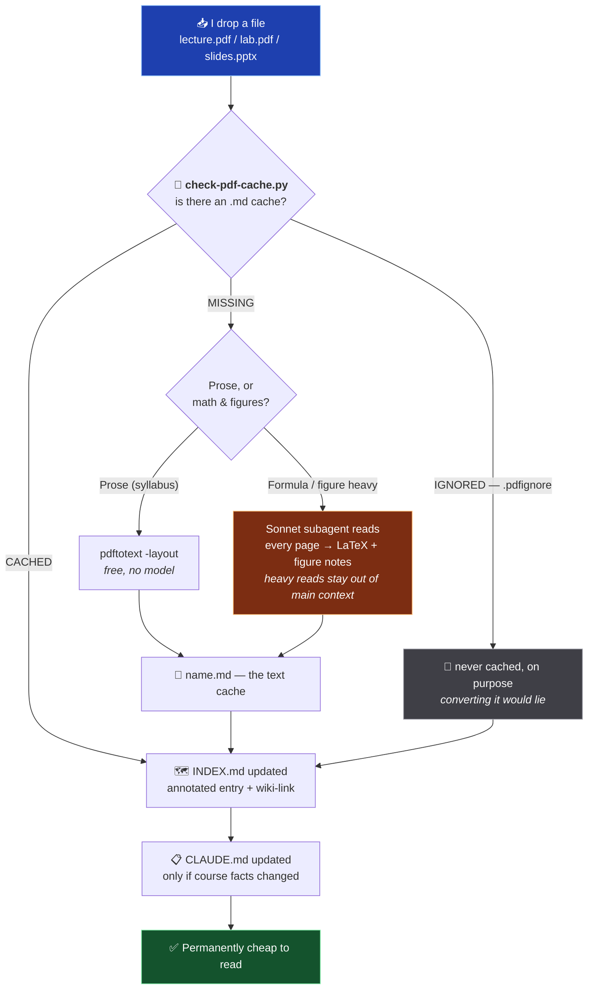

# KMUTT Year 3, Semester 1 — Computer Engineering

**One semester of coursework, built so an AI agent can actually work inside it.**

This repository is my third-year first-semester coursework at [KMUTT](https://www.kmutt.ac.th) — four courses' worth of lecture slides, assignment briefs and notes — kept as an [Obsidian](https://obsidian.md) vault. It is also, deliberately, an **agent workspace**: sitting next to the course material are three Python scripts and a small set of instruction files that let any AI agent opened in this folder already know what I'm studying, who teaches it, what's been covered, and what's due — without me explaining a thing.

> **TL;DR** — I drop a lecture PDF into a folder. The repo turns it into machine-readable Markdown, writes a summary of it into a map file, and links it into a graph. Every question after that is cheap. I never explain my semester to a chatbot twice.

---

## What's actually in here

```
kmutt-y3-s1/
├── CLAUDE.md                    # 🧠 vault-wide rules for the agent — read first, always
├── README.md                    # 📖 you are here
├── PROBLEM.md                   # 🐛 my running pain-point log for the system itself
│
├── save-checkpoint.py           # ⭐ one-command checkpoint: add + commit + push
├── check-pdf-cache.py           # 🔎 which PDFs still need a Markdown cache (honours .pdfignore)
├── check-links.py               # 🔗 does every [[link]] and [text](path) still resolve?
│
├── CPE333-operating-systems/    # 🟢 one folder per class, identical shape
├── CPE334-software-engineering/ # 🟢
├── CPE342-machine-learning/     # 🟢
├── PRE380-engineering-economy/  # 🟢
│
├── format-template/             # 🧬 the seed — copy this to create a new class
├── prompts/                     # 🗂️  my own reusable prompt drafts — not part of the system
│
├── .claude/                     # ⚙️  agent config
│   ├── commands/update-index.md #    the ingest command
│   ├── skills/pdf-cache/        #    Law I — PDF → Markdown, the cheap way
│   ├── skills/vault-writing/    #    Law II — link syntax, formatting, prose wrap
│   └── settings*.json           #    permissions
├── .gitignore                   # 🙈 temp/, secrets, node_modules
└── .obsidian/                   # 🔗 vault config — committed, so settings travel with a clone
```

### Every class folder is the same shape

Identical layout across all classes isn't aesthetics — it's what lets an agent navigate a course it has never seen before without being told anything.

```
<CODE>-<kebab-case-name>/
├── CLAUDE.md      # 📋 course facts + class-specific rules (instructor, grading, policies)
├── INDEX.md       # 🗺️ annotated map of every file — the agent's entry point
├── .pdfignore     # 🚫 optional — PDFs in this class that must never be cached
├── lecture/       # 📚 from the lecturer: slides, PDFs, readings (+ their .md caches)
├── assignment/    # ✏️  briefs, my working files, submissions
├── note/          # 🖊️  my own writing worth keeping
└── temp/          # 🗑️  scratch. volatile. never documented. here be dragons.
```

**Where does a file go?** From the lecturer → `lecture/`. About one assignment → `assignment/`. My own keeper writing → `note/`. Half-baked garbage → `temp/`.

### Class roster — Semester 1 / 2026

| Code       | Course               | Folder                                                       | Status         |
| ---------- | -------------------- | ------------------------------------------------------------ | -------------- |
| **CPE333** | Operating Systems    | [`CPE333-operating-systems`](CPE333-operating-systems)       | 🟢 active      |
| **CPE334** | Software Engineering | [`CPE334-software-engineering`](CPE334-software-engineering) | 🟢 active      |
| **CPE342** | Machine Learning     | [`CPE342-machine-learning`](CPE342-machine-learning)         | 🟢 active      |
| **PRE380** | Engineering Economy  | [`PRE380-engineering-economy`](PRE380-engineering-economy)   | 🟢 active      |
| GEN101     | Physical Education   | `GEN101-physical-education`                                  | ⚪ not created |
| GEN241     | Beauty of Life       | `GEN241-beauty-of-life`                                      | ⚪ not created |

---

## The idea: hard compute once, cheap forever

Every conversation with an AI assistant starts at zero. You paste a slide deck, explain which course it's for, explain that the deadline is one week and the lecturer forbids posted solutions, get an answer, close the tab — and all of that context evaporates. Meanwhile the raw material is hostile to machines: a lecture deck is 83 slides of _images_, so reading it burns enormous context and every equation comes out as `������`.

So pay that expensive cost **exactly once**, at ingest, and write the result down in durable plain text.

| Phase                                                                                        | Cost                                                     | How often               |
| -------------------------------------------------------------------------------------------- | -------------------------------------------------------- | ----------------------- |
| **Ingest** — read the PDF, transcribe the math, describe the figures, summarize, index, link | Expensive (a subagent reads every page)                  | **Once per file, ever** |
| **Query** — "explain LDA", "help me plan Lab 1", "what's on the midterm?"                    | Nearly free (reads a 40-line map, then one cached `.md`) | Unlimited               |

My entire job is step one of a two-step pipeline: put the file in the folder.



The whole pipeline is one command: [`/update-index`](.claude/commands/update-index.md).

---

## The three-layer context protocol

The core design. An agent entering this repo reads **top-down, narrowing**, and is oriented before it opens a single real file.

| Layer | File                          | Answers                                        | Analogy              |
| ----- | ----------------------------- | ---------------------------------------------- | -------------------- |
| 1     | Root [`CLAUDE.md`](CLAUDE.md) | _How does this system work?_                   | The OS               |
| 2     | `<class>/CLAUDE.md`           | _What is this course, and how do I help here?_ | Per-app config       |
| 3     | `<class>/INDEX.md`            | _What's in this folder, and what's it about?_  | The filesystem index |
| 4     | The file itself               | _The actual content_                           | The data             |

**Why `INDEX.md` matters more than it looks.** It isn't a file listing — it's a _summary layer_. Each entry says what the file covers in enough detail that the agent can answer many questions **without opening the file at all**, and knows exactly which file to open when it can't. It's a hand-maintained cache of "what do I know about this course." That's the whole trick.

> **Real example** — the Lecture 1 entry in [`CPE342-machine-learning/INDEX.md`](CPE342-machine-learning/INDEX.md) breaks 83 slides into three sections with every topic named. An agent asked "where do I learn about the Bayes decision boundary?" answers correctly having read ~40 lines.

---

## The two laws

Two rules do most of the heavy lifting. Each is stated in a few lines in [`CLAUDE.md`](CLAUDE.md), spelled out in full in a skill of its own, and applied automatically by `/update-index`. **The skills are the source of truth** — the summaries here are deliberately short, because a README that restates them in full is a README that will quietly contradict them.

### 📜 Law I — the reading rule

PDFs load as **images**, and the cost repeats every session. So every deck gets a permanent Markdown twin, generated once and read forever after — cheaply with `pdftotext` when it's prose, or by a throwaway Sonnet subagent that transcribes the math into LaTeX when `pdftotext` would mangle it. The expensive page reads happen _inside the subagent_ and never touch the main thread's context.

**Whether a file already has a cache is a script's answer, not a judgement call.** Eyeballing a directory listing gets it wrong the moment a `.pptx`, its reading-copy `.pdf` and the `.md` sit side by side — three files, one document — and a listing can't see `.pdfignore` at all. [`check-pdf-cache.py`](check-pdf-cache.py) answers it in one call, with no dependencies and no model involved.

**And the cache is a proxy, never the truth.** The ranking is `.pdf` **>** its `.md` cache **>** `INDEX.md`, and every step down loses something — a machine transcription of eighty slides will occasionally produce an equation that looks plausible and is simply wrong. Work from the `.md` by default; open the real page the moment an answer turns on an exact value, formula, figure or the lecturer's precise wording.

**`.pdfignore` is the escape hatch, because some PDFs are pure cost.** Thirty-two pages of compound-interest tables convert into misaligned columns where every value sits under the wrong heading — and a silently wrong cache is _a lie the agent will believe_. Any folder can carry one, with the same semantics as `.gitignore`. The file still gets its `INDEX.md` entry; it just never gets a cache.

**Full procedure:** [`pdf-cache`](.claude/skills/pdf-cache/SKILL.md).

### 🔗 Law II — the linking rule

This is an Obsidian vault, so every reference to a real file is a `[[wiki-link]]`, never dead text in backticks. Links survive renames, show up in backlinks, and turn the vault into a navigable graph instead of a folder of orphans. Folders, dot-directories, paths outside the vault and `<placeholder>` patterns stay in backticks — they aren't files.

What makes this a _law_ rather than a style preference: a wiki-link Obsidian can't resolve still **looks** valid. Extensions, path-qualified basenames, literal heading anchors, and the file types Obsidian ignores unless told otherwise are each a way to write a link that renders fine and goes nowhere. So [`check-links.py`](check-links.py) resolves every one of them — after blanking out code fences and LaTeX, because the docs here quote link syntax as an _example_ constantly and `\left[…\right](2)` is a Markdown link to any regex.

**Full syntax and every edge case:** [`vault-writing`](.claude/skills/vault-writing/SKILL.md).

> **This README is the one deliberate exception.** It uses relative Markdown links, because GitHub renders `[[…]]` as literal dead text. Relative links work in both GitHub _and_ Obsidian.

---

## Commands & scripts

|      | Name                                                             | What it does                                                                                                                                                                                                         |
| ---- | ---------------------------------------------------------------- | -------------------------------------------------------------------------------------------------------------------------------------------------------------------------------------------------------------------- |
| ⭐🧠 | [`/update-index [folder]`](.claude/commands/update-index.md)     | **The ingest pipeline.** Lists a class folder, caches every un-cached PDF, diffs disk against `INDEX.md`, rewrites both docs to match reality, verifies every link resolves, updates the class table. Skips `temp/`. |
| ⭐💾 | [`python save-checkpoint.py`](save-checkpoint.py)                | **The checkpoint.** Stages the whole vault from the repo root, commits as `<dd>/<mm>/<BE year>-<n>` with `n` read back out of `git log`, pushes with `--push`. `-n` adds a note, `--dry-run` shows the plan.         |
| 🔎   | [`python check-pdf-cache.py`](check-pdf-cache.py)                | Law I's lookup. Pairs every `.pdf`/`.pptx` with its `.md` twin and reports only the unpaired ones — one file or a whole folder, `.pdfignore` applied, `temp/` skipped. Zero dependencies, zero model calls.          |
| 🔗   | [`python check-links.py`](check-links.py)                        | Law II's enforcement. Resolves every `[[wiki-link]]`, `[text](path)` and `#heading` anchor in the vault. Separates broken from merely risky (ambiguous basenames, extensions Obsidian hides).                        |
| 📄   | [`pdf-cache`](.claude/skills/pdf-cache/SKILL.md) (skill)         | Law I in full. Loads only when a PDF is about to be opened.                                                                                                                                                          |
| 📐   | [`vault-writing`](.claude/skills/vault-writing/SKILL.md) (skill) | Law II in full. Loads only when markdown is actually being written.                                                                                                                                                  |

The two starred entries are the product; everything else is scaffolding. They attack the same enemy — **drift** — on two axes: `/update-index` keeps _what the agent knows_ in sync with disk, `save-checkpoint.py` keeps _what git records_ in sync with what I actually did. Neither asks me to stop being a person who dumps files in folders and forgets to commit. They just make catching up cost one keystroke.

---

## Quick start

```bash
git clone https://github.com/jakkarin-promsee/kmutt-y3-s1.git
cd kmutt-y3-s1
claude
```

**One setup step.** In Obsidian: \*Settings → Files and links → **Detect all file extensions\*** — on. Without it Obsidian ignores `.pptx` and `.py` entirely, and any `[[link]]` to one renders perfectly while resolving to nothing. It lands in `.obsidian/app.json`, which **is committed here**, so flipping it once and committing that file fixes every clone — but Obsidian only writes the file when it exits, so close the app before you commit.

### Daily use — this is the entire workflow

**1. Drop the file where it belongs.**

```
CPE342-machine-learning/lecture/Lecture+2+-+Regression.pdf
```

**2. Tell the agent to absorb it.**

```bash
/update-index CPE342-machine-learning
```

**3. There is no step 3.** Ask it anything.

```
> I have Lab 1 due Friday. Walk me through what it's actually asking for.
> Quiz me on Lecture 1 — I have a midterm.
> Brainstorm three approaches for the assignment, then tell me which one is dumb.
```

The agent already read the course policies, the grading breakdown, the instructor's quirks, and every lecture I've ever added. I don't brief it. That's the point.

**Then, when I stand up from the desk:**

```bash
python save-checkpoint.py
```

One line, no message to write, no branch to pick. Staged, committed as `04/08/2569-3`, pushed.

---

## Design principles

**1. Plain text or it didn't happen.** Everything is Markdown — readable by me, by Obsidian, by GitHub, by any model, by `grep`, and by whatever replaces all of them in two years.

**2. The map is the product.** `INDEX.md` and `CLAUDE.md` aren't documentation _about_ the system — they _are_ the system. The folders are just storage.

**3. Auto-find, never interrogate.** Neither command asks me what changed; they both go look. A tool that needs me to accurately describe my own mess inherits my unreliability.

**4. Push expensive work down.** Heavy page-by-page reads happen in a throwaway subagent whose context dies with it. The main thread stays clean and cheap.

**5. Every class is identical.** Uniform structure is what makes a new course zero-cost to onboard — for me _and_ for the agent.

**6. Friction is the only real failure mode.** A correct system I don't run is worth less than a decent system I run constantly. Both commands are one line and zero decisions, because the version that demanded thought is the version I'd abandon in nine days.

**7. Teach, don't just answer.** Written directly into the instruction files: explain the _why_, push back when I'm wrong, and for graded work help me learn rather than hand me something to submit. Academic integrity is a config value here, not a vibe.

## Non-goals

- ❌ **Not a cheating machine.** Class policies are written into each class's `CLAUDE.md`, and the agent is instructed to walk me through gradable work instead of doing it. That constraint is deliberate and load-bearing.
- ❌ **Not a general note-taking app.** It's an agent context substrate that happens to be readable by humans.
- ❌ **Not portable to your semester without edits.** Fork it, gut the class folders, keep the two laws.

---

## FAQ

<details>
<summary><b>Is this over-engineered for university homework?</b></summary>
<br>

Yes.

</details>

<details>
<summary><b>Why not just paste the PDF into the chat every time?</b></summary>
<br>

That is the exact cost this repo exists to eliminate. Pasting is `O(n)` in questions asked. This is `O(1)` — you pay once at ingest and the marginal cost of question #200 is reading a 40-line map. Also, pasting loses every equation, and you'd have to re-explain the grading policy each time.

</details>

<details>
<summary><b>What happens if I just... don't update the index?</b></summary>
<br>

It degrades exactly as gracefully as any other cache: the files still exist and are still readable, the agent just doesn't know they're there until it looks. Then you run `/update-index` and it self-heals. Correctness is never at risk — only cost.

</details>

<details>
<summary><b>Why is there a <code>temp/</code> folder banned from all documentation?</b></summary>
<br>

Because a system that demands every scratch file be catalogued is a system I will abandon in nine days. `temp/` is the pressure-release valve: a designated place for garbage, explicitly excluded from `INDEX.md`, `CLAUDE.md`, and every agent listing.

</details>

<details>
<summary><b>Can I use this for my own semester?</b></summary>
<br>

Fork it, delete my classes, copy `format-template/` per course. The two laws and the three-layer protocol are the actual portable part.

</details>

---

<div align="center">

**Built by a third-year Computer Engineering student at KMUTT**<br/>
who decided that explaining the same syllabus to an AI four hundred times<br/>
was a worse use of a semester than building this.

<sub><b>Hard compute once. Cheap forever.</b></sub>

</div>
